# Bonus Parcial

En este repositorio se encuentra el bonus del parcial de AREP, el cual calcula: Seno, Coseno, Palindromo y la magnitud de un vector real.

## Para empezar

Descargue y copie el repositorio en su maquina local.

### Prerrequisitos

- Java
- Maven

### Ejecución

Primero, compile el proyecto con el siguiente comando:

```
mvn clean install
```

Después, ejecute el siguiente comando para correr el programa:

```
java -cp "target/classes;target/dependency/*" edu.escuelaing.arep.app.SparkWebServer
```

Debe ingresar a la siguiente direccion:

```
http://localhost:4567/index
```

Estando ahi la pagina se vera asi:
<br>


### Funcionamiento y Código

### Función Seno

El siguiente código calcula el seno de un numero ingresado por el usuario.
<br>


<br>
Esto se ve en pantalla asi:
<br>


Si hacemos el calculo por la url se ve asi:
<br>


Y desde la aplicación asi:
<br>


### Función Coseno
El siguiente código calcula el Coseno de un numero ingresado por el usuario.
<br>


<br>
Esto se ve en pantalla asi:
<br>


Si hacemos el calculo por la url se ve asi:
<br>


Y desde la aplicación asi:
<br>


### Función Palindromo
#### Para esta función hay que asegurarnos que la palabra no tenga espacio, si tiene espacio, siempre sera no palindroma.
El siguiente valida si una palabra es palindromo o no.
<br>


<br>
Esto se ve en pantalla asi:
<br>


Si hacemos la función desde la la url se ve asi:
<br>

Cuando es palindromo
<br>


<br>
Y cuando no


Y desde la aplicación asi:


Cuando no es Palindromo
<br>


<br>
Cuando es palindromo
<br>


### Función Vector
El siguiente código calcula la magnitud de un vector real el cual recibe dos entradas.
<br>


<br>
Esto se ve en pantalla asi:
<br>


Si hacemos el calculo por la url se ve asi:
<br>


Y desde la aplicación asi:
<br>


### Docker
Construimos la imagen:
Debe ingresar a la siguiente dirección:

```
docker build --tag dockersparkprimer .
```

<br>

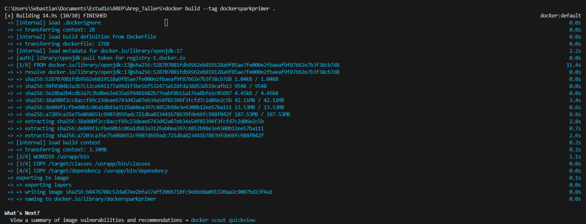

<br>

Revisamos que la imagen quede construida con el siguiente comando:

```
docker images
```

<br>

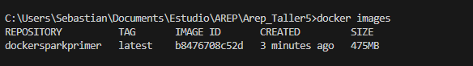

<br>

A partir de la imagen creada creamos 3 instancias:

```
docker run -d -p 34000:6000 --name firstdockercontainer dockersparkprimer
docker run -d -p 34001:6000 --name firstdockercontainer2 dockersparkprimer
docker run -d -p 34002:6000 --name firstdockercontainer3 dockersparkprimer
```

<br>

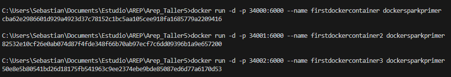

<br>

Nos aseguramos que el contendor esta corriendo:

```
docker ps
```

<br>

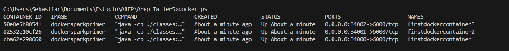

<br>

Accedemos por el browser a las siguientes direcciones, para verificar que esta corriendo:

```
http://localhost:34002/index
http://localhost:34001/index
http://localhost:34000/index
```

Asi se vería la pagina:
<br>

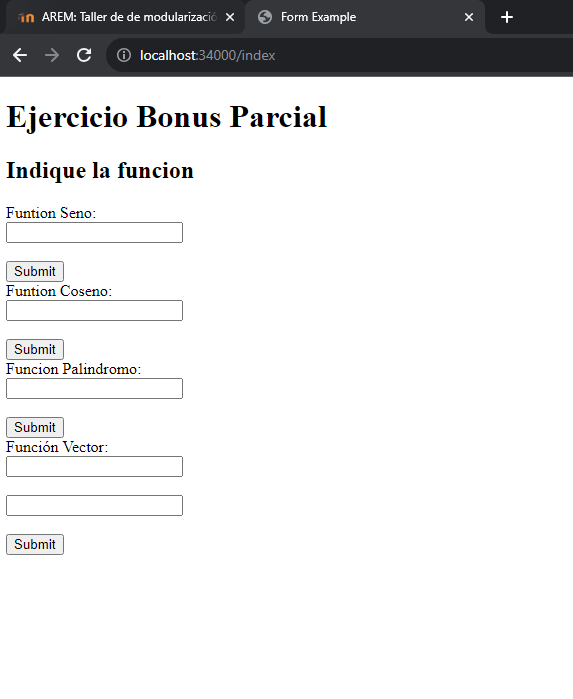

<br>


Ejecutamos el docker compose
```
docker-compose up -d
```

Asi se vería la pagina:
<br>

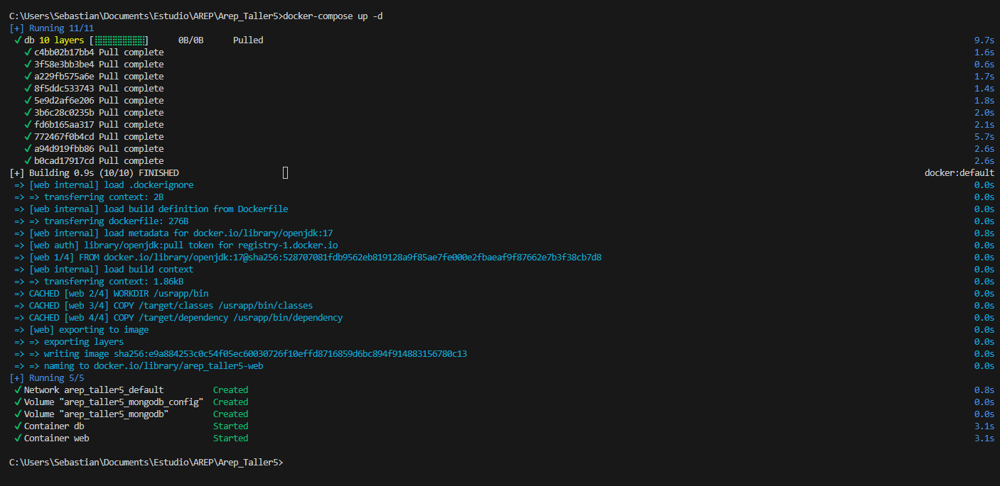

<br>

Verificamos que se crearon los servicios:

```
docker ps
```

Asi se vería la pagina:
<br>

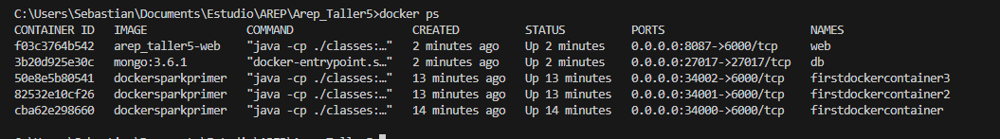

<br>

Asi se ve el docker desktop:
<br>

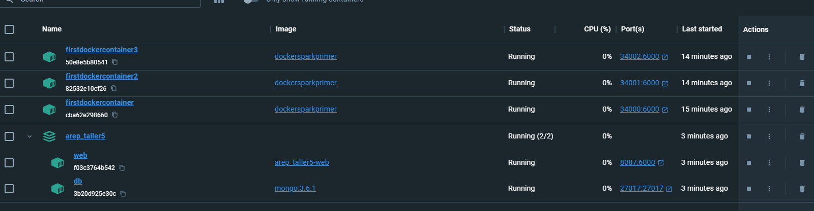

<br>
Creamos el repositorio y revisamos que se haya creado:
<br>

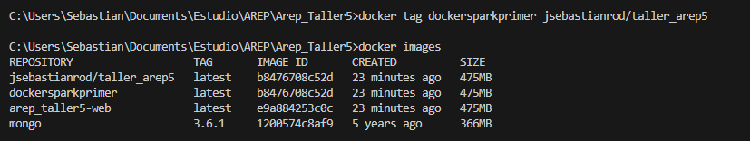

<br>
Hacemos push al repositorio:

<br>

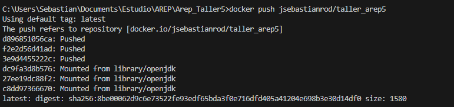

<br>
Revisamos que se haya subido, en docker hub:

<br>

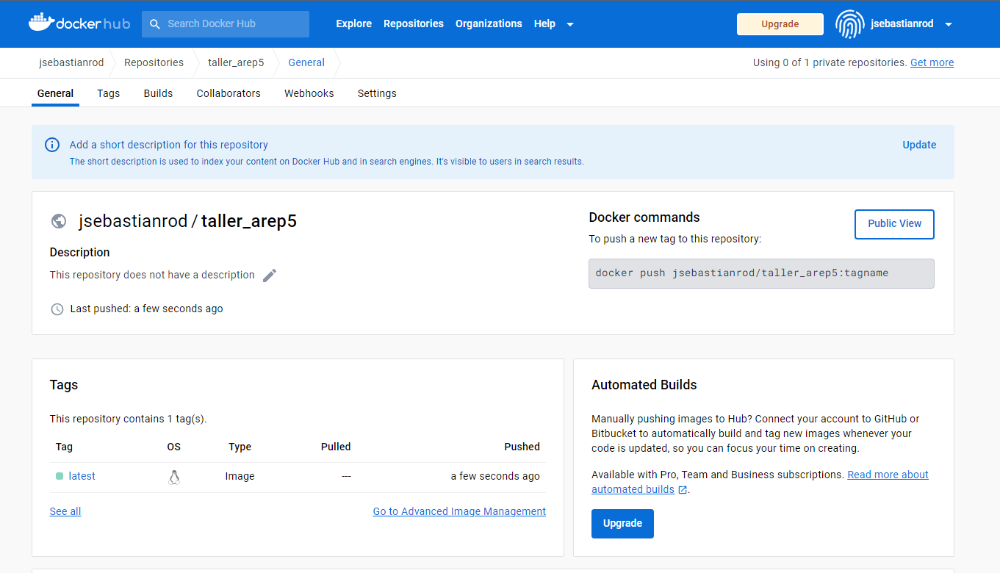

<br>

La pagina en la cual se encuentra el repositorio es la siguiente:

```
https://hub.docker.com/r/jsebastianrod/taller_arep5
```

### Correr el Docker

1. Para correr el docker debe ejecutar el siguiente comando:

```
docker pull jsebastianrod/taller_arep5
```

2. Después debe ejecutar el siguiente comando:

```
docker ps
```

Ahi revisamos en que puerto esta

3. Por ultimo usamos el comando, el cual va a probar la conexión:
    
```
docker run jsebastianrod/taller_arep5
```
4. Como podemos ver, la conexión fue exitosa:
<br>

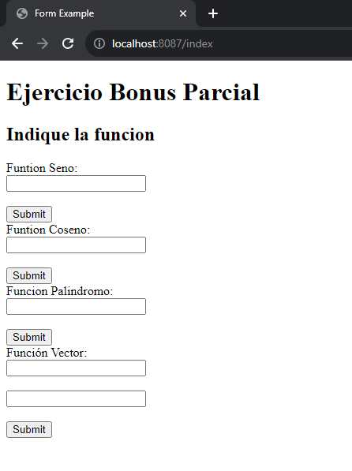
<br>
Entramos al puerto 8087 el cual obtuvimos en el paso 2:
<br>

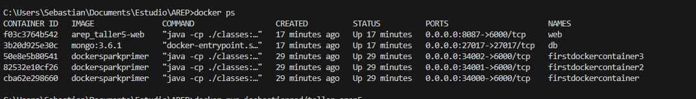
<br>


