# Bonus Parcial

En este repositorio se encuentra el bonus del parcial de AREP, el cual calcula: Seno, Coseno, Palindromo y la magnitud de un vector real.

## Para empezar

Descargue y copie el repositorio en su maquina local.

### Prerrequisitos

- Java
- Maven

### Ejecución

Primero, compile el proyecto con el siguiente comando:

```
mvn clean install
```

Después, ejecute el siguiente comando para correr el programa:

```
java -cp "target/classes;target/dependency/*" edu.escuelaing.arep.app.SparkWebServer
```

Debe ingresar a la siguiente direccion:

```
http://localhost:4567/index
```

Estando ahi la pagina se vera asi:
<br>

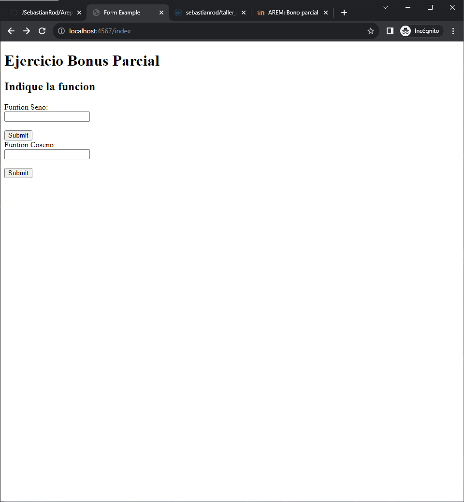


### Funcionamiento y Código

### Función Seno

El siguiente código calcula el seno de un numero ingresado por el usuario.
<br>

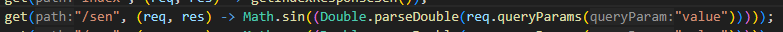
<br>
Esto se ve en pantalla asi:
<br>


Si hacemos el calculo por la url se ve asi:
<br>

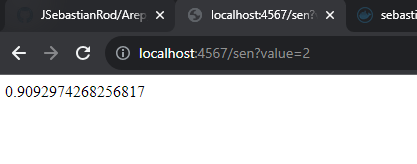

Y desde la aplicación asi:
<br>

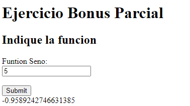

### Función Coseno
El siguiente código calcula el Coseno de un numero ingresado por el usuario.
<br>

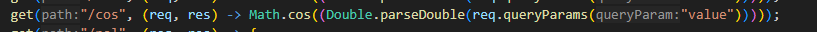
<br>
Esto se ve en pantalla asi:
<br>

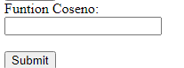


Si hacemos el calculo por la url se ve asi:
<br>

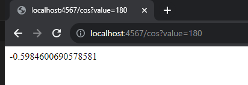

Y desde la aplicación asi:
<br>

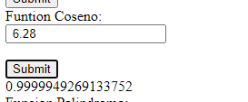

### Función Palindromo
El siguiente valida si una palabra es palindromo o no.
<br>

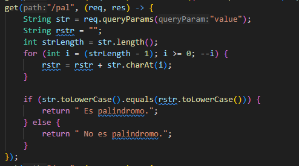
<br>
Esto se ve en pantalla asi:
<br>

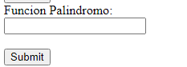


Si hacemos la función desde la la url se ve asi:
<br>

Cuando es palindromo
<br>
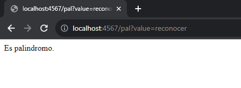

<br>
Y cuando no

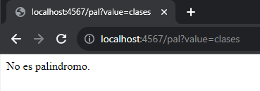


Y desde la aplicación asi:


Cuando no es Palindromo
<br>

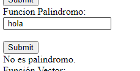

<br>
Cuando es palindromo
<br>

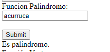

### Función Vector
El siguiente código calcula la magnitud de un vector real el cual recibe dos entradas.
<br>

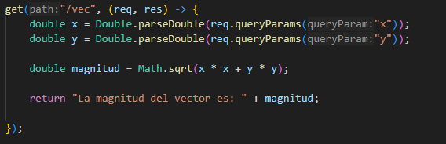
<br>
Esto se ve en pantalla asi:
<br>

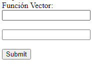


Si hacemos el calculo por la url se ve asi:
<br>

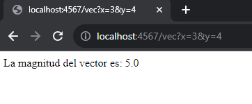

Y desde la aplicación asi:
<br>

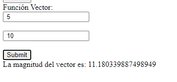

link docker
https://hub.docker.com/r/sebastianrod/bonoparcial
